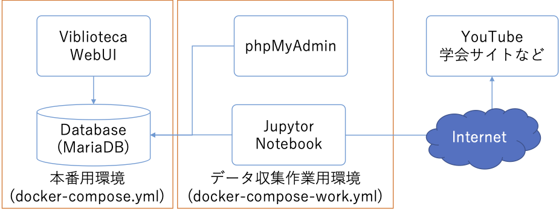

# viblioteca

学会のウェビナーなどの公開動画のメタ情報(タイトル，公開日，閲覧URLなど)を取得してDBに格納し、検索・閲覧UIを提供するシステムです。閲覧は、動画公開サービス(YouTube等)が提供している表示インタフェースを利用しています。サービスの設定により、動画がそのまま表示できる場合も、サービスへのリンクが表示される場合もあります。

## 構成

本システムは、本番用環境とデータ収集作業用環境から構成されます。本番環境はPythonで開発されたWebUIとDatabaseから構成され、データ収集作業用環境は動画を情報してDatabaseへ格納するJupyter Notebookと、DB内容を閲覧したりダンプの作成を行うphpMyAdminから構成されます。




## 起動方法

### 動作環境

以下のOSやミドルウェアを想定しています。

* Linux系OS(MacOS含む)
* Docker
* docker-compose

Windowsは、WSL(Windows Subsystem for Linux)がインストールされていれば動作する可能性はありますが、動産検証は行っていません。


### 開発モード(Development Mode)

以下のコマンドを実行すると、開発モード用の構成が起動します。

```
bash startup_dev.sh
```

開発モードでは、本番モードのソフトウェアに加えて、以下のものが起動します。

* Jupyter Notebook
    * 学会ページやYouTubeから動画情報を取得しDBに格納する処理を記述したNotebook
    * アクセスURL: http://localhost:8888/
* PHPMyAdmin
    * DBの内容を閲覧するWebアプリ
    * アクセスURL: http://localhost:8080/


### 本番モード(Production Mode)

以下のコマンドを実行すると、本番モード用の構成が起動します。

```
bash startup.sh
```

本番モードでは、以下のものが起動します。

* 動画検索・閲覧WebUI
    * アクセスURL: http://localhost:8089/
* データベース(MariaDB)


## 利用方法

