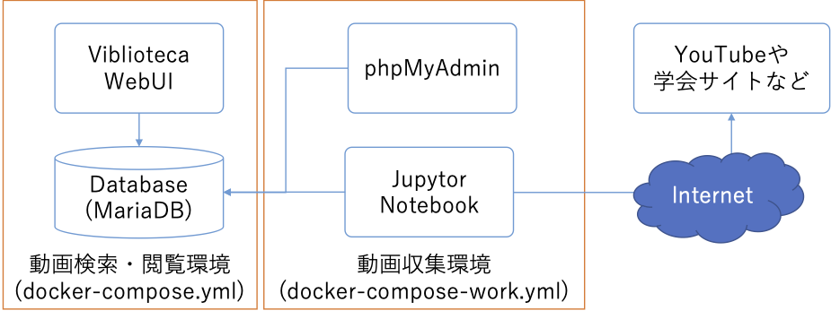
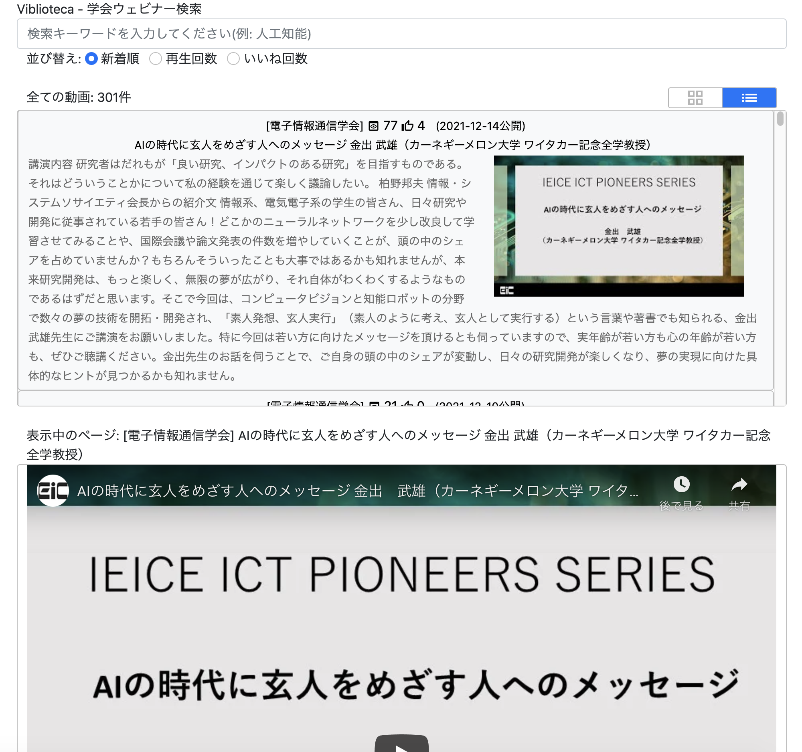

# viblioteca

学会のウェビナーなどの公開動画のメタ情報(タイトル，公開日，閲覧URLなど)を取得してDBに格納し、検索・閲覧UIを提供するシステムです。閲覧は、動画公開サービス(YouTube等)が提供している表示インタフェースを利用しています。サービスの設定により、動画がそのまま表示できる場合も、サービスへのリンクが表示される場合もあります。

## 構成

本システムは、動画検索・閲覧環境と動画収集環境から構成されます。動画検索・閲覧環境はPythonで開発されたWebUIとDatabaseから構成され、データ収集環境は動画を情報してDatabaseへ格納する処理が格納されているJupyter Notebookと、DB内容を閲覧したりダンプの作成を行うphpMyAdminから構成されます。




## 起動方法

### 動作環境

以下のOSやミドルウェアを想定しています。

* bashと以下のソフトウェアが動作するOS
* Docker
* docker-compose

動作検証は、Ubuntu Linux 18.04 LTSおよびMacOS Xで行っています。Windowsは、WSL2(Windows Subsystem for Linux)がインストールされていれば動作する可能性はありますが、動産検証は行っていません。

### 初期設定

本システムを起動するには、まず以下の手順で、設定ファイルを作成してください。

1. work/config.yml.sampleをコピーしてwork/config.ymlを作成する
1. Google Cloudにログインし、API KEYを発行する(YouTube Data APIのみ利用可能にしておくことが望ましいです)
1. work/config.yml内のgoogle/apiKeyに、発行したAPI KEYを設定する。

API KEYは、動画収集を行う際に使用されます。

なお、build/dbディレクトリにデータベースのダンプ(phpMyAdminでエクスポートしたSQL(拡張子: .sql)またはそれをgzipしたもの(拡張子: .sql.gz))を置いておくと、初回起動時にそれがインポートされます。


### 動画検索・閲覧環境の起動

以下のコマンドを実行すると、動画検索・閲覧環境が起動します。

```
bash startup.sh
```

以下のソフトウェアが起動します。

* 動画検索・閲覧WebUI
    * 動画の検索・閲覧を行うWebUIです。
    * アクセスURL: http://localhost:8089/
* データベース(MariaDB)
    * 動画のメタ情報を格納するデータベースです。


### 動画収集環境

以下のコマンドを実行すると、動画収集環境が起動します。


```
bash startup_work.sh
```

このコマンドを実行すると、動画検索・閲覧環境のソフトウェアに加えて、以下のものが起動します。

* Jupyter Notebook
    * 学会ページやYouTubeから動画情報を取得しDBに格納する処理を記述したNotebook
    * アクセスURL: http://localhost:8888/
* phpMyAdmin
    * DBの内容を閲覧するWebアプリ
    * アクセスURL: http://localhost:8080/


## 利用方法

### 動画情報の収集

動画情報収集環境を起動し、Jupytor Notebookをブラウザで開いてください。

downloadMetaInfo.ipyenv内のセルを順番に実行すると、学会の動画ウェブサイトおよびYouTubeから、動画のメタ情報が取得され、データベースに格納されます。

なお、現在、以下の動画ウェブサイトに対応しています。

* IEICE Ondemand Webinar https://webinar.ieice.org/

また、YouTubeは以下のチャンネルに対応しています(config.ymlのyoutube/channelsに記述したチャンネルの動画情報が取得されます)

* 電子情報通信学会 https://youtube.com/channel/UCDMkjDeK_8WafkMvIfbtTKQ
* 情報処理学会 https://youtube.com/channel/UC8uVGnC5MTi4KnbJGNFUXog
* 情報処理学会インタラクションシンポジウム https://youtube.com/channel/UCVzAsIAtO8aVCV43QNF48XA
* sigec https://youtube.com/channel/UCg6i7YNuslvlN0_RlZQ-ggQ
* Dr. AyumiとDr. MoeのUBIチャンネル https://youtube.com/channel/UCtqftmHFhN6DsHGjfVqneAA
* DBSJ最強データベース講義 https://youtube.com/channel/UCaOkRhbjsqviiDQdKn-p0HA
* signl ipsj https://youtube.com/channel/UClzd97uGh4I_nwRM4hbgZqw
* AAC IPSJ https://youtube.com/channel/UCXWW29NBsGlvgsj9bNo_CoA


### 動画の検索・閲覧

動画収集環境を起動して動画情報を収集した後、動画検索・閲覧WebUIにウェブブラウザでアクセスしてください。以下のような画面が表示されます。



検索キーワードを入力すると、そのキーワードをメタ情報に含む動画のみがリストアップされます。動画の並び順は新着順、再生回数順、いいね順があり、それぞれ検索キーワードの下のラジオボックスで変更できます。検索結果の表示には、グリッド表示とリスト表示があり、画面右上のアイコンで切り替えられます。

リストアップされた動画をクリックすると、画面下の動画閲覧部分に動画が表示されます。ただし、コンテンツの登録者が閲覧を許可していない場合は、動画が公開されているページへのリンクが表示されます。


### 補足

本システムでは、インターネットに公開されている情報のみ取得しています。学会の会員サイトなどの内容は対象としていません。動画データ自体も取得しません。動画の閲覧方法は、提供元のサイトのポリシーに従っています。提供元のポリシーにより本システム内で動画表示ができない場合、提供元サイトへのリンクが表示されます。

